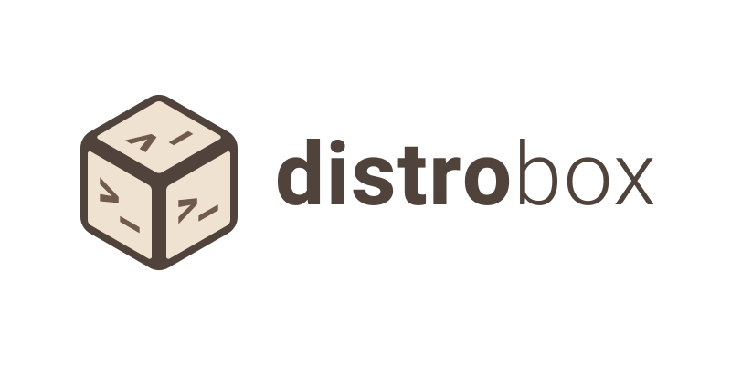

  <picture>
    <source media="(prefers-color-scheme: dark)" srcset="static/assets/brand/png/distrobox-dark.png" />
    
  </picture>

  <strong>Use any linux distribution inside your terminal.</strong>

---

[Matrix Room](https://matrix.to/#/%23distrobox:matrix.org) - [Telegram Group](https://t.me/distrobox)

Use any Linux distribution inside your terminal. Enable both backward and forward
compatibility with software and freedom to use whatever distribution you’re more comfortable with.

Distrobox uses `podman`, `docker` or [`lilipod`](https://github.com/89luca89/lilipod) to create containers
using the Linux distribution of your choice. The created container will be tightly integrated with the
host, allowing sharing of the HOME directory of the user, external storage, external USB devices and
graphical apps (X11/Wayland), and audio.

## Documentation

Documentation for the [latest release](https://github.com/89luca89/distrobox/releases/latest) is available
over at [distrobox.it](https://distrobox.it). Documentation on GitHub strictly refers to the code in the
main branch and is not optimized for being viewed without building it as the website.
